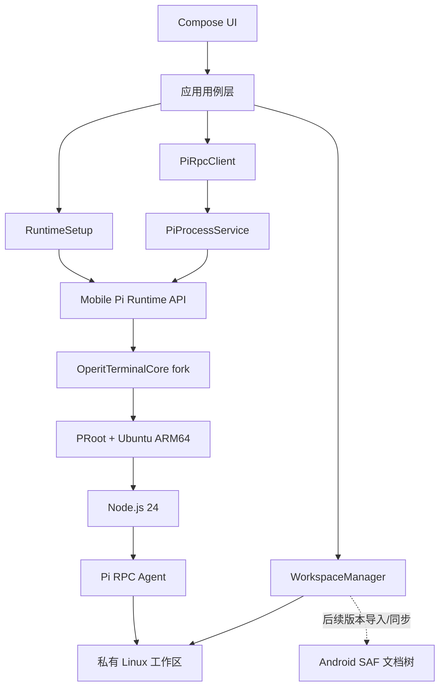

# Mobile Pi 技术设计

> 状态：方案基线
>
> 基线日期：2026-08-03
>
> 目标平台：Android 8.0+、ARM64

## 1. 摘要

Mobile Pi 在 Android 应用内部提供 Ubuntu/PRoot 运行环境，安装 Node.js 24 和固定版本的 Pi coding agent，并通过 `pi --mode rpc` 将 Pi 接入原生 Compose UI。应用不要求用户安装 Termux，也不复用 Operit 自身的 Agent 和产品 UI。

核心边界如下：

- `OperitTerminalCore` fork 负责 Linux rootfs、PRoot、native 可执行文件和基础进程能力。
- Mobile Pi 的 `PiRuntime` 负责安装、健康检查、版本迁移和进程生命周期。
- `PiRpcClient` 负责严格 JSONL 协议、请求关联、事件流和 extension UI 子协议。
- Android 产品层负责会话、工作区、凭据、权限和用户交互。
- Pi 仍是 Agent 能力的唯一来源；Mobile Pi 不复制或改写 Pi 的 Agent 循环。

第一阶段只验证运行链路，不试图证明所有 Pi package 和 extension 都兼容。完整 Linux 用户空间提高了兼容率，但不提供 systemd、Docker、真实 root、内核特性或桌面 GUI。

## 2. 目标与非目标

### 2.1 产品目标

1. 用户只安装一个 APK，即可在手机上运行 Pi。
2. Pi 能使用内置工具读取、创建和修改工作区文件，并执行 Linux 命令。
3. Android UI 能流式展示回复、工具调用、错误和运行状态。
4. 后续版本支持 Pi packages、extensions、skills、prompt templates 和标准 RPC extension UI。
5. 文件访问遵守 Android 存储模型，并对直接修改手机文件的风险保持可见。
6. 运行环境、Pi 和应用自身可以独立版本化、诊断和升级。

### 2.2 第一阶段非目标

- 不访问共享存储或任意手机目录。
- 不持久化 Pi 会话。
- 不提供 packages、extensions、skills 的安装或管理 UI。
- 不实现 extension UI 请求。
- 不在后台持续运行 Agent。
- Release 产品界面不提供终端、SSH、FTP、SSHD 等 TerminalCore 附带功能；Debug 构建保留用户主动打开的本地 Ubuntu 诊断终端。
- 不支持多工作区、多进程或多会话并发。
- 不处理离线安装、断点下载和生产级运行环境升级。
- 不以 Google Play 上架为验收条件。

### 2.3 长期非目标

- 不承诺兼容依赖真实 root、systemd、Docker、KVM、FUSE、桌面环境或内核模块的扩展。
- 不模拟 Pi 的完整终端 TUI。Android UI 只实现 RPC 可表达的能力。
- 不把 PRoot 描述为安全沙箱或虚拟机。
- 不默认申请 `MANAGE_EXTERNAL_STORAGE`。

## 3. 已验证事实与设计假设

### 3.1 OperitTerminalCore 基线

已核对提交 `f85be57944b806de4d863dee8b10d80d04daa236`：

- 官方 README 将其定义为可独立复用的 Android module。
- `compileSdk = 36`、`minSdk = 26`、Java/Kotlin JVM target 17。
- 当前只打包 `arm64-v8a`。
- 内置约 64.1 MB 的 Ubuntu Noble ARM64 压缩 rootfs。
- 内置 bash、BusyBox、PRoot loader 等 native 文件。
- 提供 PTY、`TerminalManager`、`TerminalService`、AIDL 和 Ubuntu `DocumentsProvider`。
- 现有设置流程通过 NodeSource 安装 Node.js 24，再使用 npm/pnpm 安装工具。

### 3.2 Pi 基线

本机已安装并核对 `@earendil-works/pi-coding-agent` `0.81.1`：

- 要求 Node.js `>=22.19.0`。
- 支持 `--mode rpc`。
- RPC 通过 stdin/stdout 使用严格 LF 分隔的 JSONL。
- 提供 prompt、abort、状态、模型、思考等级、会话、压缩、bash 等命令及流式事件。
- RPC 模式支持 `select`、`confirm`、`input`、`editor`、`notify` 等标准 extension UI 请求。
- `ctx.ui.custom()` 和若干直接依赖 TUI 的接口在 RPC 模式不可用或降级。
- Pi package 可来自 npm、Git 或本地路径，安装过程可能执行第三方代码及 npm lifecycle scripts。

### 3.3 必须由第一阶段验证的假设

以下内容不能仅凭桌面端或 Operit 的实现推定成立：

1. Android 目标设备允许从应用 native 目录启动 raw bash/PRoot 子进程并保持三条独立管道。
2. Node.js 24 ARM64 和 Pi 的全部必需依赖能在该 Ubuntu rootfs 中正常安装、加载和联网。
3. Pi 的内置 `bash`、`read`、`write`、`edit` 工具能在 PRoot 路径和权限模型下工作。
4. 进程退出、取消和应用前后台切换不会留下不可控的 Pi/Node 子进程。
5. stdout 在非 PTY 路径上只包含有效 RPC JSONL，不出现运行环境登录输出。

## 4. 总体架构



### 4.1 信任边界

- Android 应用 UID 沙箱是主要系统边界。
- PRoot 负责路径和用户空间兼容，不是权限隔离边界。
- Pi、已启用的 Pi 资源和 Pi package 共享同一 Linux 用户与应用 UID。
- 被挂载或复制进工作区的内容属于 Agent 可访问范围。
- 提供给 Pi 的 API key 在 Pi 及其已加载 extension 的同一信任边界内。

### 4.2 一次请求的主流程

1. UI 将用户输入提交给会话用例。
2. 用例确认运行环境和 Agent 进程为 `READY`。
3. `PiRpcClient` 生成请求 ID，编码一行 JSON，并以 `\n` 结尾写入 stdin。
4. Pi 通过 stdout 发送 response 和 event。
5. RPC 解码器按字节增量解码 UTF-8，只按 LF 切帧。
6. response 通过请求 ID 完成对应请求；event 更新会话状态和消息列表。
7. stderr 独立进入诊断日志，不参与 RPC 解析。
8. 收到 `agent_end` 后，会话从运行中回到可输入状态。

## 5. 源码与模块边界

### 5.1 建议仓库结构

```text
mobile-pi/
├── app/                         # Application、导航和依赖组装
├── runtime/
│   ├── terminal-core/           # 指向自有 fork 的 Git submodule
│   └── pi/                      # RuntimeSetup、raw process、RPC client
├── feature/
│   ├── setup/                   # 运行环境安装与诊断
│   ├── chat/                    # 会话 UI
│   ├── workspaces/              # 后续版本的文件授权与同步
│   └── resources/               # 后续版本的 Pi 包与资源管理
├── core/
│   ├── model/                   # 应用领域模型
│   ├── storage/                 # DataStore、数据库、Keystore 封装
│   └── logging/                 # 脱敏日志
└── docs/
```

第一阶段只建立 `app`、`runtime/terminal-core` 和 `runtime/pi` 三个 Gradle module。只有当对应功能进入开发时才拆分 `feature` 和 `core`，避免为了未来结构增加当前验证成本。

### 5.2 TerminalCore 直接复用内容

- Ubuntu Noble ARM64 rootfs 和解压逻辑。
- `liboperit_proot.so`、loader、bash、BusyBox 等 native 资产。
- rootfs 路径、启动脚本和 `/proc`、`/dev`、Android 存储映射逻辑。
- 必要的初始化互斥、权限修复和健康状态辅助代码。
- PTY、ANSI 渲染和虚拟键盘能力，仅在 Debug 构建接入诊断终端 UI。

### 5.3 TerminalCore fork 新增内容

- 不分配 PTY 的 `RawProcessLauncher`。
- 结构化 `RuntimePaths`，避免 Mobile Pi 复制内部路径拼接。
- 可取消且幂等的 rootfs 初始化 API。
- 进程树终止、退出码和 stderr 管道。
- 独立的健康检查入口。
- 针对 Mobile Pi 使用路径的 instrumentation tests。

### 5.4 不复用的 Operit 内容

- Operit Agent、模型、工具包、记忆和自动化体系。
- Operit 聊天 UI、角色和工作流。
- SSH、FTP、SSHD 和远程终端界面。
- Operit 的全文件权限产品策略。
- 与 Pi RPC 无关的 TerminalCore 产品 UI；终端渲染代码只供 Debug 诊断入口复用，不进入 Release 产品导航。

## 6. 内嵌运行环境

### 6.1 构建要求

- Android SDK 36。
- JDK 17。
- Android NDK 和 CMake 3.22.1，与已核对 TerminalCore 基线一致。
- 仅生成 `arm64-v8a` APK/AAB split。
- 第一阶段必须使用 ARM64 真机；模拟器测试只能作为补充。

### 6.2 打包与首次安装

第一阶段沿用 TerminalCore 的约 64.1 MB Ubuntu rootfs，随 APK 打包。首次启动时解压至应用私有目录，然后联网安装 Node.js 和 Pi：

```bash
curl -fsSL https://deb.nodesource.com/setup_24.x | bash -
apt-get install -y nodejs ca-certificates git
npm install -g @earendil-works/pi-coding-agent@0.81.1
```

实际脚本必须满足：

- 固定 Pi 版本；不能使用未固定的 `latest`。
- 每一步记录开始、结束、退出码和可展示的错误摘要。
- 不把 API key 或完整环境变量写入日志。
- 安装完成后写入版本 manifest，不能只依赖“目录存在”。
- 重试前先执行健康检查，已完成步骤不得无条件重复。

第一阶段接受联网安装慢、不能断点续传等限制。生产版本再评估预构建 Node/Pi runtime bundle，以换取确定性和离线能力。

### 6.3 目录布局与挂载契约

Android `Context.filesDir` 是 Mobile Pi 运行数据的宿主根目录。主用户中通常为 `/data/user/0/dev.mobilepi/files`，`/data/data/dev.mobilepi/files` 是等价入口；非主用户的数字部分随 Android user ID 变化，代码必须始终从 `Context.filesDir` 获取，不能硬编码绝对路径。

当前 PoC 的宿主目录与 guest 视图如下：

| 用途 | Android 宿主路径（相对 `filesDir`） | PRoot guest 路径 | 生命周期 |
|---|---|---|---|
| Ubuntu rootfs | `usr/var/lib/proot-distro/installed-rootfs/ubuntu` | `/` | 运行环境安装，可升级或重装 |
| Pi 可执行文件 | `usr/var/lib/proot-distro/installed-rootfs/ubuntu/usr/bin/pi` | `/usr/bin/pi` | 随运行环境版本管理 |
| 当前工作区 | `workspaces/poc/files` | `/workspace` | 用户工作数据，重装 runtime 时保留 |
| Pi 共享目录 | `pi` | `/mobile-pi/pi` | 应用级 Pi 数据，所有 Agent 共享 |
| Pi 全局配置 | `pi/config` | `/mobile-pi/pi/config` | 用户级设置与资源配置，所有会话共享 |
| 临时目录 | `tmp` | `/tmp` | 可清理的运行时临时数据 |

PRoot 将 rootfs 作为 guest `/`，再把宿主工作区和 Pi 共享目录覆盖到固定 guest 路径。因此终端执行 `cd / && ls` 看到的是组合后的 Ubuntu 文件系统视图，不是 `filesDir` 的直接列表；其中 `/workspace` 和 `/mobile-pi` 位于 guest 根目录下。

rootfs 内会创建实体目录 `/workspace` 和 `/mobile-pi/pi` 作为挂载目标。它们不拥有工作数据，也不是历史遗留目录：挂载生效时，访问分别转发到 `filesDir/workspaces/poc/files` 和 `filesDir/pi`；底层实体目录被覆盖。不得把这些挂载目标纳入缓存清理或迁移删除清单，必需挂载失败时 terminal 和 Agent 必须启动失败，不能继续使用未挂载的底层目录。

诊断 terminal 与非 PTY Pi Agent 必须使用相同的工作区源目录、guest 目标和 Pi 全局配置源目录。可以通过以下命令在 terminal 中核对内容，但运行逻辑不能依赖 `/data/user/0` 这一特定 user ID：

```bash
ls -la /workspace
ls -la /data/data/dev.mobilepi/files/workspaces/poc/files
ls -la /mobile-pi/pi/config
ls -la /data/data/dev.mobilepi/files/pi/config
```

后续多工作区版本继续保留固定 guest `/workspace`，但每个 Agent 的独立 PRoot 进程把它映射到各自的 `workspaces/<workspace-id>/files`；`/mobile-pi/pi` 仍指向同一个应用级宿主目录。多会话细节见 7.3 节。

### 6.4 安装状态机

| 状态 | 含义 | 允许操作 |
|---|---|---|
| `NOT_INSTALLED` | 未发现有效 manifest | 开始安装 |
| `EXTRACTING_ROOTFS` | 正在解压 Ubuntu | 取消、查看日志 |
| `INSTALLING_NODE` | 正在安装 Node.js | 取消、查看日志 |
| `INSTALLING_PI` | 正在安装固定 Pi | 取消、查看日志 |
| `VERIFYING` | 正在执行健康检查 | 查看日志 |
| `READY` | 全部检查通过 | 启动 Agent |
| `FAILED` | 安装步骤失败 | 重试、清除并重装 |
| `BROKEN` | manifest 存在但健康检查失败 | 修复或重装 |
| `UPGRADING` | 后续版本执行事务式升级 | 取消或回滚 |

安装状态必须持久化；进程被 Android 杀死后，下一次启动从健康检查恢复，而不是相信中断前状态。

### 6.5 版本 manifest

建议存储以下字段：

```json
{
  "schemaVersion": 1,
  "rootfsVersion": "ubuntu-noble-pd-v4.18.0",
  "terminalCoreCommit": "f85be57944b806de4d863dee8b10d80d04daa236",
  "nodeVersion": "24.x.y",
  "piVersion": "0.81.1",
  "abi": "arm64-v8a",
  "installedAt": "ISO-8601",
  "lastVerifiedAt": "ISO-8601"
}
```

manifest 只描述期望和最近验证结果，不能替代实际健康检查。

### 6.6 健康检查

按从低到高顺序执行：

1. native bash 可执行且退出码为 0。
2. 能进入 PRoot Ubuntu，`uname -m`/用户空间架构符合预期。
3. `node --version` 满足 Pi 的 engine 约束。
4. `pi --version` 等于当前 pin。
5. `pi --mode rpc --no-session` 能响应一次 `get_state`。

前四项属于常规快速检查；第五项在安装完成、升级后和诊断页中执行。

### 6.7 后续升级策略

- rootfs、Node 和 Pi 分别版本化，禁止静默跨大版本更新。
- 下载内容必须校验 SHA-256，并使用临时目录安装。
- 新运行环境通过健康检查后再切换 active manifest。
- 升级失败保留旧环境和用户工作区。
- Pi 配置、会话、packages 与 rootfs 分目录存储，避免升级 rootfs 时一起删除。

## 7. Agent 进程与 RPC

### 7.1 进程启动

`PiProcessService` 通过 `RawProcessLauncher` 启动 native bash，再进入 PRoot Ubuntu 并 `exec` Pi。概念命令如下，实际参数由结构化 API 构建，不能拼接未经转义的用户输入：

```text
native bash
  -> TerminalCore PRoot login command
  -> cd <private-workspace>
  -> exec pi --mode rpc <version-specific-options>
```

第一阶段 Pi 参数建议为：

```text
--mode rpc
--no-session
--no-extensions
--no-skills
--no-prompt-templates
--no-themes
--no-context-files
```

这样只验证 Pi 核心、模型调用和内置文件工具，避免 project trust、第三方代码和 TUI 兼容问题影响结论。

进程环境至少包含固定 `HOME`、`PATH`、`LANG=C.UTF-8`、`PI_CODING_AGENT_DIR` 和所选 provider 的 API key。API key 通过环境变量传递，不写入命令行、Shell profile 或诊断包。

### 7.2 RawProcessLauncher 契约

```kotlin
interface RawProcessLauncher {
    suspend fun start(spec: RawProcessSpec): RawProcess
}

interface RawProcess {
    val stdin: OutputStream
    val stdout: InputStream
    val stderr: InputStream
    val exit: Deferred<ProcessExit>
    suspend fun terminate(gracePeriodMs: Long)
}
```

实现优先使用 Android `ProcessBuilder` 启动已打包且可执行的 native bash，`redirectErrorStream(false)`。如果目标 Android 版本上的进程组、管道或可执行限制无法满足验收，则在 fork 中增加 `fork`/`pipe`/`dup2`/`execve` 的 JNI raw process 实现。两种实现都不得调用 `forkpty()`。

### 7.3 多会话进程与目录映射

后续版本允许多个会话持久存在，并允许受设备资源上限约束的多个 Agent 进程并发运行。每个活动会话拥有独立的 Agent 进程和当前工作区，但所有 Agent 进程共享同一份 Pi 全局配置。

每个 Agent 的 PRoot 文件系统映射独立建立：会话选择的宿主工作区统一映射为 guest `/workspace`，应用级 Pi 目录统一映射为 guest `/mobile-pi/pi`，并设置 `PI_CODING_AGENT_DIR=/mobile-pi/pi/config`。例如：

| Agent 进程 | 宿主工作区 | Guest 工作目录 | 宿主 Pi 全局目录 | Guest Pi 全局目录 |
|---|---|---|---|---|
| Session A | `workspaces/a/files` | `/workspace` | `pi` | `/mobile-pi/pi` |
| Session B | `workspaces/b/files` | `/workspace` | `pi` | `/mobile-pi/pi` |

工作区路径不能由 UI 以任意字符串直接传入 launcher，必须通过 `WorkspaceId` 解析为已授权且规范化的宿主路径。launcher 应允许受管工作区根目录下的合法路径或经过对应渠道授权的直接工作区，不能继续只允许单个 PoC 目录。

会话切换工作区只允许在 Agent 空闲时执行。切换操作必须停止旧 Agent、原子更新 `Session.workspaceId`、以新映射启动 Agent，再恢复该会话状态；运行中的切换请求应拒绝或在用户确认后先中止，不能通过向现有进程发送 `cd` 来改变约束。旧进程的迟到 RPC 事件必须通过进程实例标识丢弃。

Pi 全局配置的普通读取可以并发；package 安装、升级、全局迁移及其他结构性写入必须取得应用级独占锁，并与所有 Agent 进程的启动和运行互斥。会话历史、临时文件、日志和恢复元数据按 `SessionId` 隔离，不能写入共享配置文件。应用可保存任意数量的会话，但应根据真机内存和发热测试限制并发 Agent 数量。

诊断终端打开时绑定当前选中会话的工作区，并共享同一 Pi 全局配置。由于 TerminalCore 当前的本地运行配置是进程级单例，多工作区版本需要支持按 terminal session 传入运行配置，或在切换诊断目标时明确重建 terminal session。

### 7.4 JSONL 解码规则

- 输入按原始字节增量读取，使用有状态 UTF-8 decoder。
- 只把字节 `0x0A`（LF）作为记录边界。
- 接受记录末尾可选 CR，但不把 Unicode `U+2028`、`U+2029` 当成换行。
- 空行视为协议错误并记录，不交给 JSON parser。
- 单帧设置大小上限；超限时停止进程并报告协议故障，防止内存失控。
- JSON 解析失败必须保留脱敏后的原始帧摘要、进程版本和前后事件序号。
- stdout 不允许兼作普通日志；所有运行环境和 Pi 诊断信息走 stderr。

### 7.5 RPC 能力分期

第一阶段只实现：

- 命令：`get_state`、`prompt`、`abort`。
- response：请求 ID、成功、错误。
- event：`agent_start`、`message_update`、`tool_execution_start/update/end`、`message_end`、`agent_end`、`extension_error`。
- UI 只渲染文本增量、工具名、工具最终状态和错误摘要。

后续版本增加：

- 会话：`get_messages`、`new_session`、`switch_session`、`get_entries`、`fork`。
- 模型：`get_available_models`、`set_model`、思考等级。
- 队列：`steer`、`follow_up`、queue event。
- 上下文：compaction、session stats。
- 资源：`get_commands` 和 extension commands。
- extension UI：request/response 子协议。

RPC event 本身没有请求 ID，不能错误地与最近一个命令绑定；会话状态必须依靠事件类型、tool call ID 和 Agent 生命周期组合更新。

### 7.6 Agent 生命周期

| 状态 | 进入条件 | 退出条件 |
|---|---|---|
| `STOPPED` | 尚未启动或正常结束 | 用户启动 |
| `STARTING` | raw process 已创建 | 首次有效 RPC response |
| `READY` | 可接受 prompt | prompt 被接受或进程退出 |
| `RUNNING` | 已收到 `agent_start` | `agent_end`、abort 或进程退出 |
| `STOPPING` | 用户停止或应用关闭 | 进程退出 |
| `CRASHED` | 非预期退出或协议故障 | 用户重启 |

停止顺序：发送 RPC `abort`，等待短暂宽限；关闭 stdin；发送进程终止；宽限后强制终止整个子进程树。不能只杀死外层 bash 而遗留 Node。

### 7.7 Service 策略

- `0.1.0` 使用同进程、仅在前台页面存活的 bound service 或生命周期组件，减少变量。
- `0.2.0` 引入非 exported 的 foreground service，执行中显示系统通知，并遵守 Android 后台启动限制。
- UI 进程重建后，通过 RPC `get_state` 和持久化会话恢复界面，不依赖内存中的 Compose 状态。
- 不允许其他应用绑定或向 Agent 注入命令。

## 8. 数据与文件系统

### 8.1 建议目录

```text
<app-files>/
├── runtime/
│   ├── rootfs/                  # Ubuntu rootfs
│   ├── manifest.json
│   └── logs/
├── pi/
│   ├── config/                  # PI_CODING_AGENT_DIR
│   ├── sessions/
│   └── packages/
└── workspaces/
    └── <workspace-id>/
        ├── files/               # Pi 实际工作目录
        └── sync-manifest.json   # 托管工作区后续使用
```

凭据不写入 rootfs 或 Pi 配置目录；这些目录可能被 Pi extension 读取，也可能进入用户导出的诊断包。

### 8.2 Android 文件访问的关键约束

SAF 提供 `content://` URI 和 `ContentResolver`，不是普通 POSIX 路径，不能天然 bind mount 进 PRoot。TerminalCore 的 Ubuntu `DocumentsProvider` 解决的是“让其他 Android 应用访问 Ubuntu 文件”，并不能反向把任意 SAF 文档树变成 Linux 目录。

因此文件访问分为两种模式：

| 模式 | 适用发行渠道 | 实现 | 特点 |
|---|---|---|---|
| 托管工作区 | Play 和默认版本 | SAF 授权后导入应用私有目录，Pi 修改副本，再由应用同步回文档树 | 最小权限、可审查，但不是实时原地修改 |
| 直接工作区 | 明确允许全文件访问的侧载版本 | 获取直接路径并映射到 PRoot，例如 `/sdcard` | 兼容 CLI 工具，但权限范围大且可能不符合 Play 政策 |

第一阶段只使用应用私有测试工作区，不实现上述两种手机文件模式。

### 8.3 托管工作区同步

`0.2.0` 的默认策略：

1. 用户通过 `ACTION_OPEN_DOCUMENT_TREE` 选择目录并保存持久 URI grant。
2. 应用复制文档树至私有 `workspaces/<id>/files`。
3. 导入时记录相对路径、document ID、大小、修改时间和按需 hash。
4. Pi 只操作私有副本。
5. Agent 完成后，应用计算新增、修改和删除清单。
6. 用户确认后才写回；目标文件在外部发生变化时标记冲突，不静默覆盖。
7. SAF provider 不支持原子替换时，采用备份和 best-effort 写入，并明确显示部分失败。

初版只允许一个活动工作区，不实现实时双向 watcher。同步期间禁止 Agent 写入，避免生成不一致快照。

### 8.4 直接工作区

直接工作区只在独立 product flavor 中提供，并满足：

- 首次使用时单独解释访问范围。
- 工作区必须由用户明确选择，不能默认将整个 `/sdcard` 作为当前目录。
- UI 显示当前直接路径和风险状态。
- 发布前重新核对目标应用商店对 `MANAGE_EXTERNAL_STORAGE` 的政策。
- 测试 Android 多用户存储路径，不能硬编码 `/storage/emulated/0`。

## 9. Android UI 与应用状态

### 9.1 第一阶段单屏 UI

只保留完成验证所需控件：

- 运行环境状态和“安装/重试”按钮。
- provider、model、API key 三个开发配置输入项；API key 默认不持久化。
- 启动/停止 Agent 控件。
- 简单消息列表、文本输入和发送/中止按钮。
- 折叠式诊断区域，显示阶段、退出码和脱敏 stderr。
- Debug 构建在 runtime READY 后显示本地 Ubuntu 终端入口，复用 TerminalCore PTY，不作为 Release 功能；终端固定使用与非 PTY Agent 相同的 PRoot 模式，共享 `/workspace` 和 `PI_CODING_AGENT_DIR=/mobile-pi/pi/config`。这两个宿主注入挂载属于启动必需条件，挂载失败时终端必须报错退出，不能静默回退到 rootfs 内的同名目录。

不实现首页宣传内容、会话侧栏、文件浏览器、Markdown 高级渲染或产品级终端。

### 9.2 后续 UI 状态

- 安装过程必须可恢复，不能用单个 loading boolean 表示。
- Agent `READY`、`RUNNING`、`CRASHED` 状态在导航切换后仍一致。
- 工具执行使用固定高度/约束的条目，流式输出不能导致控件重排失控。
- extension UI 的 confirm/select/input/editor 映射为原生 dialog 或 bottom sheet，并通过请求 ID 返回。
- TUI-only extension 应显示“不支持此交互”，不能无限等待。

## 10. 安全设计

### 10.1 威胁模型

- 模型可能受工作区内容 prompt injection 影响并调用文件或 Shell 工具。
- Pi package、extension 和 npm install scripts 是可执行代码。
- API key、私有源码和共享存储文件是主要敏感资产。
- PRoot 内的进程仍以应用 UID 访问 Android 授权范围内的数据。
- 广泛存储权限会把一次 Agent 错误扩大为全盘文件风险。

### 10.2 控制措施

- 默认使用托管工作区和最小 SAF grant，不申请全文件权限。
- `0.1.0` 禁用所有 extension、skill、prompt template 和项目上下文发现。
- `0.3.0` 启用资源前显示来源、版本、可执行代码风险和项目信任状态。
- 凭据使用 Android Keystore 包装加密；密文存 DataStore/数据库，明文只在需要时进入进程环境。
- 日志统一脱敏 API key、Authorization header、用户输入和可能包含凭据的命令。
- Service、Provider 之外的组件默认 `exported=false`；AIDL 不对第三方应用开放。
- 导出的诊断包默认不包含工作区内容、会话正文、Pi 配置和环境变量。
- 外部写回前展示 diff 摘要，删除操作需要明确确认。
- 用户安装的 extension 与 API key 无法在同一 Pi 进程内强隔离；产品必须把它表达为信任决定。

### 10.3 项目信任

Pi 自带 project trust 只控制是否加载项目本地设置和资源，不限制 Agent 工具。Mobile Pi 必须保留这一语义，不能把“已信任”展示成“已沙箱保护”。

## 11. 可靠性与可观测性

### 11.1 结构化日志

每条日志至少包含：

- 应用版本、runtime manifest 版本、Pi 版本。
- session ID、process instance ID、递增事件序号。
- 安装步骤或 RPC event 类型。
- 耗时、退出码和错误分类。

日志分为应用、安装、进程、RPC、同步五类。stdout 原始内容只在协议错误时保留截断和脱敏摘要。

### 11.2 错误分类

- `RuntimeInstallError`：rootfs、apt、npm 安装失败。
- `RuntimeHealthError`：版本或可执行检查失败。
- `ProcessStartError`：raw process 无法启动。
- `ProcessExitError`：Pi 意外退出。
- `RpcProtocolError`：分帧、UTF-8 或 JSON 不合法。
- `RpcCommandError`：Pi 返回 `success=false`。
- `ProviderError`：模型鉴权、网络、限流或服务端错误。
- `WorkspaceSyncError`：SAF 读取、写入或冲突。

用户界面显示可操作的错误和重试入口；详细堆栈只进入脱敏诊断日志。

### 11.3 崩溃恢复

- 应用启动时检测残留 PID/锁文件，但以实际进程和健康检查为准。
- Agent 意外退出后不自动无限重启；一次受限重启失败即进入 `CRASHED`。
- 安装和升级通过文件锁防止多入口并发执行。
- 工作区写回保存操作日志，应用重启后能识别“未开始、部分完成、已完成”。

## 12. 测试策略

### 12.1 JVM 单元测试

- JSONL 在任意字节位置拆包、粘包。
- UTF-8 多字节字符跨 chunk。
- LF、可选 CRLF、字符串内 `U+2028/U+2029`。
- 空行、无效 JSON、超大帧和流结束时残留内容。
- 请求 ID 关联、超时、重复 response 和乱序 response。
- Agent 状态机和安装状态机的所有转移。
- 日志脱敏。
- 托管工作区 diff 和冲突算法。

### 12.2 Instrumentation 测试

- rootfs 首装、中断、重试和二次启动。
- raw process 三管道分离。
- abort、正常退出、强制退出和进程树清理。
- Activity 重建与 Service 重连。
- SAF grant 持久化、导入、写回和部分失败。

### 12.3 端到端测试

- 使用可控 fake RPC 子进程测试 UI，不消耗模型额度。
- 使用真实 Pi 和测试 provider 完成 prompt、流式回复和工具调用。
- 让 Pi 创建、读取、修改一个确定内容的文件，并由 Android 侧独立验证。
- 注入 stderr 噪声，确认不影响 stdout RPC。
- 安装一个带标准 extension UI 的受控测试包，验证后续兼容层。

### 12.4 设备矩阵

最低矩阵覆盖 API 26、30、33、35/36 的 ARM64 环境。第一阶段至少一台真实 ARM64 设备；进入 beta 前至少覆盖两家厂商及一台内存较低设备，并验证系统省电策略下的 foreground service。

## 13. 构建、依赖与发布

### 13.1 fork 管理

- `runtime/terminal-core` 指向组织控制的 Git fork，并固定 commit。
- Mobile Pi 修改按主题保持小提交，维护 `UPSTREAM.md` 记录来源和差异。
- 上游同步使用独立分支，合并后运行 native、安装和 RPC 全套测试。
- 不直接复制若干源码文件到 `app`，避免丢失历史和许可证边界。

### 13.2 依赖固定

- Gradle plugin、Kotlin、NDK、CMake、rootfs、Node major 和 Pi 使用版本目录或 manifest 固定。
- npm 全局安装固定 Pi 精确版本；保存 npm lock/shrinkwrap 或预构建 bundle 的 hash。
- 生产构建不得在运行时自动执行 `pi update self`。
- 用户安装的 Pi packages 与内置 Pi 版本分开记录兼容状态。

### 13.3 发行 flavor

- `play`：不包含全文件权限，只提供托管工作区。
- `full`：面向明确侧载渠道，可选直接工作区。
- 两个 flavor 使用相同 Agent/RPC 代码，差异只位于工作区访问策略。

### 13.4 许可证与供应链

Operit 与 OperitTerminalCore 当前采用 LGPLv3。正式分发前至少完成：

1. 保留许可证和版权声明。
2. 发布所分发 TerminalCore 版本及修改的对应源码。
3. 评估 Android APK/AAR/native 打包方式下的替换和重新链接义务。
4. 在应用内提供开源许可页面和源码获取方式。
5. 对 Ubuntu rootfs、PRoot、BusyBox、bash、Node.js、Pi 及 npm 传递依赖分别建立许可证清单。
6. 生成 SBOM，并保存所有二进制资产的来源、版本和 hash。
7. 审查 TerminalCore 当前 Gradle 对 `META-INF/LICENSE`/`NOTICE` 的排除，确保最终发行包用集中 notice 补足声明。

如产品计划闭源商业分发，应优先联系作者讨论双重许可，并在发布前进行正式法律审查。本文不是法律意见。

## 14. 性能与资源预算

第一阶段以测量为主，不因优化延误可行性结论。必须记录：

- APK 增量体积和 rootfs 解压后占用。
- rootfs 解压、Node 安装、Pi 安装各自耗时。
- Agent 冷启动和温启动耗时。
- 空闲、流式回复和 Shell 工具执行时的内存峰值。
- 30 分钟会话中的电量与发热情况。

进入 beta 前建议达到：温启动至 RPC ready 不超过 3 秒；空闲时无持续 CPU 占用；日志和 session 有容量上限；磁盘不足时在安装前阻止操作而不是解压到一半。

## 15. 兼容性定义

“支持 Pi”分为四级，不能只用一个布尔值描述：

| 级别 | 定义 |
|---|---|
| 核心兼容 | prompt、模型流式输出和内置文件/Shell 工具可用 |
| 资源兼容 | skills、prompts、themes 和无 UI extension 可加载 |
| 标准 UI 兼容 | RPC 支持的 select/confirm/input/editor/notify 可用 |
| TUI 专属 | `ctx.ui.custom()`、自定义 terminal editor/rendering 等，不支持 |

每个官方或推荐 package 应在兼容矩阵中标记级别、测试版本和已知限制。Linux 环境存在不等于所有 package 天然兼容；native npm addon 是否提供 Linux ARM64 构建仍需逐包验证。

## 16. 主要风险

| 风险 | 影响 | 第一应对措施 |
|---|---|---|
| Android raw process 无法可靠进入 PRoot | 阻断 RPC | 第一阶段优先 spike；失败则增加非 PTY JNI launcher |
| Pi 或依赖缺少 Linux ARM64 产物 | 阻断安装或部分功能 | 固定版本并在真机执行模块加载测试 |
| stdout 被启动脚本污染 | RPC 随机解析失败 | `exec` Pi、完全分离 stderr、协议启动探针 |
| NodeSource/apt/npm 网络不稳定 | 首装失败率高 | 第一阶段记录；后续改为校验过的 runtime bundle |
| Android 杀后台进程 | 长任务中断 | MVP 引入 foreground service、会话恢复和明确通知 |
| SAF 无 POSIX 路径 | CLI 无法直接处理手机目录 | 默认托管工作区；侧载 flavor 才提供直接模式 |
| extension 读取凭据或越权修改文件 | 数据泄露或损坏 | 默认禁用、来源与信任提示、最小文件授权 |
| LGPL/组件许可证处理不完整 | 无法合规发布 | 在 beta 前完成法律审查、源码发布流程和 SBOM |
| TerminalCore 上游变化大 | fork 难以维护 | 薄适配层、固定提交、小而集中的补丁 |

## 17. 第一阶段实现顺序

1. 建立最小 Android/Compose 工程并以 submodule 接入 TerminalCore fork。
2. 在目标真机完成 rootfs 初始化，显示结构化安装日志。
3. 通过 PRoot 安装固定 Node.js 和 Pi，完成四级健康检查。
4. 实现 `RawProcessLauncher`，先用测试命令证明 stdout/stderr 分离和进程树清理。
5. 实现并单元测试严格 JSONL decoder。
6. 启动禁用资源和会话的 Pi RPC，完成 `get_state`。
7. 接入单屏输入和流式文本输出。
8. 创建应用私有测试工作区，让 Pi 写入 `proof.txt`，由 Android 独立校验。
9. 验证 abort、停止、重启和至少三次连续完整运行。
10. 汇总安装耗时、启动耗时、内存、stderr 和兼容问题，作出继续/调整/停止决定。

任何 storage、package、session 或高级 UI 工作都不得插入上述验证链路。

## 18. 决策门槛

以下决定在对应版本开始前完成，不阻塞 `0.1.0`：

- `0.2.0` 前：首个正式支持的 provider、凭据持久化体验、Play 与侧载发行优先级。
- `0.3.0` 前：package 信任模型、是否允许 npm install scripts、兼容矩阵维护方式。
- `0.4.0` 前：直接工作区是否成为正式能力，以及全文件权限的渠道策略。
- beta 前：TerminalCore 双重许可或 LGPL 合规实施方案、runtime 离线包和更新服务器。

## 19. 参考资料

- [Pi 官方站点](https://pi.dev/)
- [Pi RPC 文档](https://github.com/earendil-works/pi/blob/main/packages/coding-agent/docs/rpc.md)
- [Pi packages 文档](https://github.com/earendil-works/pi/blob/main/packages/coding-agent/docs/packages.md)
- [Pi extensions 文档](https://github.com/earendil-works/pi/blob/main/packages/coding-agent/docs/extensions.md)
- [Pi 安全文档](https://github.com/earendil-works/pi/blob/main/packages/coding-agent/docs/security.md)
- [Operit](https://github.com/AAswordman/Operit)
- [OperitTerminalCore](https://github.com/AAswordman/OperitTerminalCore)
- [OperitTerminalCore TerminalManager 基线](https://github.com/AAswordman/OperitTerminalCore/blob/f85be57944b806de4d863dee8b10d80d04daa236/src/main/java/com/ai/assistance/operit/terminal/TerminalManager.kt)
- [OperitTerminalCore PTY 基线](https://github.com/AAswordman/OperitTerminalCore/blob/f85be57944b806de4d863dee8b10d80d04daa236/src/main/jni/pty.c)
- [GNU LGPLv3](https://www.gnu.org/licenses/lgpl-3.0.html)
